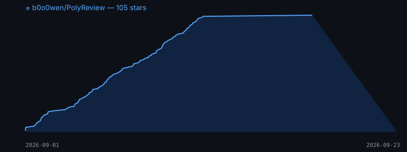

# PolyReview ⚖️

<!-- TODO(P2): social preview card (1280x640): cross-vendor reviewers converge in 3 rounds -->

[](https://github.com/b0o0wen/PolyReview/actions/workflows/ci.yml)
[](LICENSE)
[](pyproject.toml)

**Let your AI coding agents review each other.** Turn any combination of CLI agents — Claude Code, Codex, Gemini, Qwen, Kimi, OpenCode, Aider... — into a cross-review panel that interrogates your specs and diffs until they converge.

> One model reviewing itself is circular. *Different vendors* cross-examining your design doc is real review.

<!-- TODO(P2): GIF demo here — host mode: e.g. two vendors independently catch the same issue (the cross-validation money shot), host arbitrates, verdict JSON, convergence -->

## Why

- **Cross-vendor validation**: reviewers from different model families independently locate the same defects far more often than chance — real sessions showed duplicate hits on 3 separate rounds ([methodology](docs/methodology.md))
- **Converging, not endless**: verdict protocol (`APPROVE`/`REVISE` + severity-tagged issues) with a host arbitrator — real sessions converge in 2-4 rounds
- **Stateful when it helps**: each reviewer resumes its own session across rounds (remembers what it flagged), with automatic new-session fallback — correctness never depends on the memory
- **Reviewer = agent, not model**: you pick which CLIs sit on the panel; each keeps its own model/config. `polyreview scan` detects what's installed

## 30-second start (zero API cost)

```bash
# npx / pnpx (JS folks: thin launcher, Python backend auto-installed on first run)
npx polyreview demo

# uvx (fastest for Python folks; after PyPI release: `uvx polyreview demo`)
uvx --from git+https://github.com/b0o0wen/PolyReview.git polyreview demo

# or the classic way
curl -fsSL https://raw.githubusercontent.com/b0o0wen/PolyReview/main/install.sh | sh
pip install git+https://github.com/b0o0wen/PolyReview.git

polyreview demo      # mock panel: REVISE → disposition → APPROVE, no keys needed
polyreview init --host claude   # one command: MCP servers + skill into your host
```

> Prerequisite: **at least one reviewer CLI that runs a *different model family* than your host** installed & logged in. One reviewer already cross-examines your host agent; 2–3 different vendors is where cross-validation shines (`polyreview scan` checks what you have).

## Real usage

```bash
polyreview scan                      # which reviewer CLIs are installed?
polyreview init --host claude          # prints `claude mcp add ...` for each reviewer
polyreview init --host qoder --write .vscode/mcp.json --reviewers kimi,codex

# batch: one round of cross-review on a spec (or an exported git diff)
polyreview review --artifact docs/design.md --reviewers kimi,codex --mode spec
git diff main...HEAD > review_state/pr/change.diff
polyreview review --artifact review_state/pr/change.diff --mode code
```

Or drive it from your MCP host (Qoder / Claude Code / Cursor / VS Code) — **the primary mode**: your host agent arbitrates (drafts adopt/rebut dispositions, you approve) while reviewers cross-examine. Each reviewer is a standard MCP server exposing `review(request, session_id, cwd)`, `identity()`, `whereami()`. The bundled [skill](polyreview/skills/polyreview/SKILL.md) turns it into "multi-model cross-review" on demand. The batch CLI above is the CI/scripting complement (exit code 0 = unanimous APPROVE), not a second frontend — see [ROADMAP](ROADMAP.md).

## Supported reviewers

Sorted by prevalence:

| Agent | Status | Resume |
|-------|--------|--------|
| claude (Claude Code) | tested | ✅ `--resume` |
| codex (Codex CLI) | tested | ✅ `exec resume` |
| gemini (Gemini CLI) | experimental | ✅ `--resume` (per docs) |
| qwen (Qwen Code) | tested | ✅ `--resume` (fully verified) |
| kimi (Kimi Code) | tested | ✅ `kimi -r` |
| opencode | tested | ✅ `run -s` (fully verified, NDJSON) |
| aider | experimental | — (stateless by design) |
| qodercn | tested | ✅ `-r` (fully verified) |
| qoder | experimental | ✅ `-r` (syntax verified, needs login) |

Add any other CLI via `reviewers.toml` (command templates + a session-id regex) — see [registry docs](polyreview/registry.py). PRs welcome for the experimental ones; each verified adapter ships with its community's blessing.

## How it works

```
        ┌─ reviewer-kimi ──┐   verdict JSON
author ─┤                  ├─► host arbitrator ── adopt / rebut ──► next round
        └─ reviewer-codex ─┘   (blocker/major block; minor don't)      │
                                                                      ▼
                                              unanimous APPROVE / max rounds
```

Full protocol & field notes: [docs/methodology.md](docs/methodology.md) · host quirks (MCP roots, stdin inheritance, structuredContent) in [docs/host-compat.md](docs/host-compat.md).

## Status

Alpha. Proven in daily use on two hosts (Qoder, Claude Code) with kimi+codex; experimental adapters pending community verification. MIT.

中文版：[README.md](README.md)

## Star History


